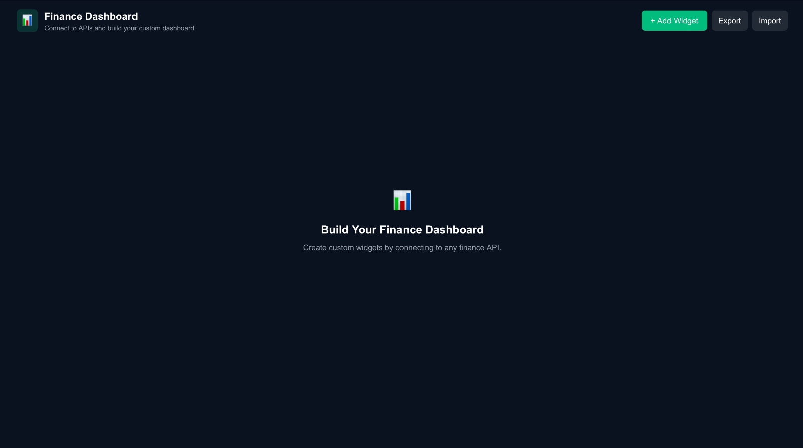
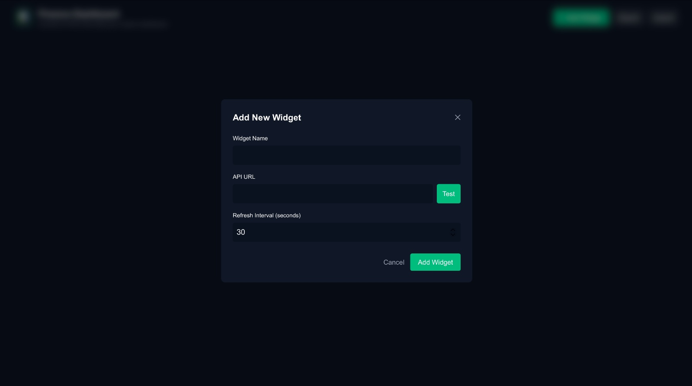
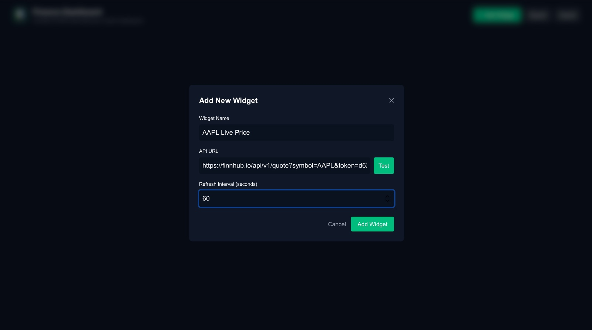
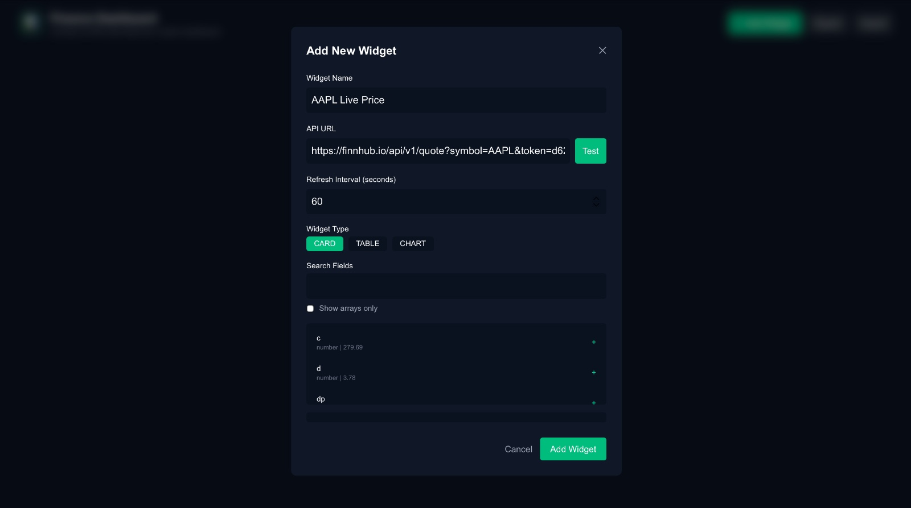
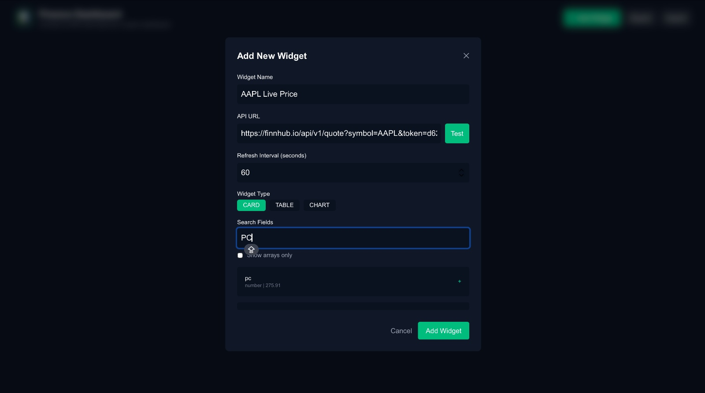
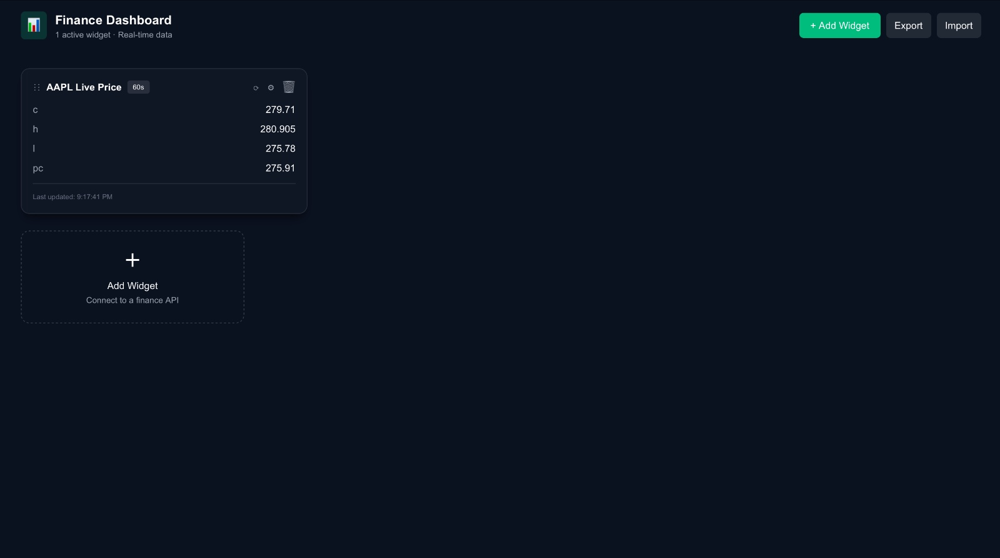
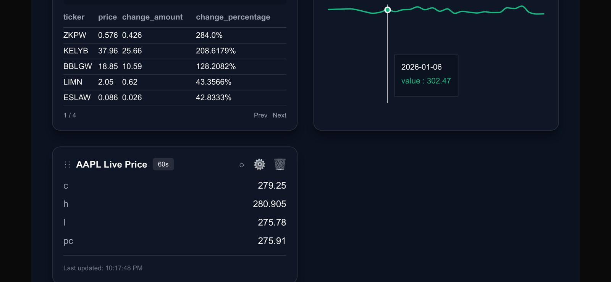
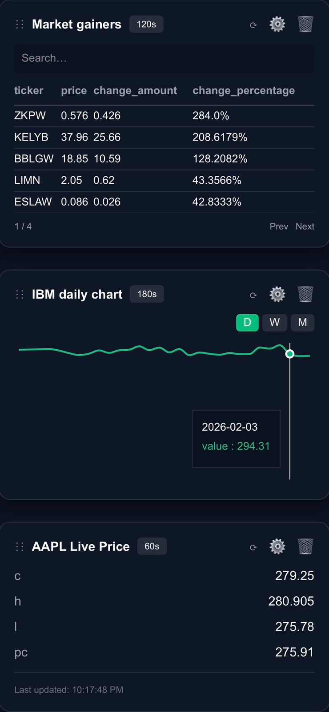

# 📊 FinBoard – Customizable Finance Dashboard

FinBoard is a customizable, real-time finance dashboard built using **Next.js**.  
It allows users to connect to financial APIs and build dynamic widgets such as **cards, tables, and charts** with live data.

This project was developed as part of a **Frontend Assignment Round**.

---

## 🚀 Features

- Connect to finance APIs (Finnhub, Alpha Vantage)
- Create dynamic widgets:
  - 📌 **Card Widgets** – Live prices, OHLC data
  - 📋 **Table Widgets** – Market gainers, losers, earnings
  - 📈 **Chart Widgets** – Daily / Weekly / Monthly trends
- Drag & drop widget rearrangement
- Auto-refresh with configurable intervals
- Search and pagination in tables
- Dynamic field selection from API responses
- Export / Import dashboard configuration
- Persistent dashboard state using `localStorage`
- Fully responsive (desktop & mobile friendly)
- Graceful handling of API errors and rate limits

---

## 🧱 Tech Stack

- **Framework:** Next.js (App Router)
- **Language:** TypeScript
- **Styling:** Tailwind CSS
- **State Management:** Zustand
- **Charts:** Recharts
- **Drag & Drop:** @dnd-kit
- **API Client:** Axios
- **Deployment:** Vercel

---

## 🔐 Environment Variables

Create a `.env.local` file in the root directory:

```env
NEXT_PUBLIC_FINNHUB_KEY=your_finnhub_api_key
NEXT_PUBLIC_ALPHA_VANTAGE_KEY=your_alpha_vantage_key
▶️ Running the Project Locally
npm install
npm run dev
Open:
👉 http://localhost:3000

📁 Project Structure
finboard-dashboard/
│
├── src/
│   ├── components/
│   │   ├── Dashboard.tsx
│   │   ├── AddWidgetModal.tsx
│   │   ├── WidgetSettingsModal.tsx
│   │   └── widgets/
│   │       ├── CardWidget.tsx
│   │       ├── TableWidget.tsx
│   │       └── ChartWidget.tsx
│   │
│   ├── services/
│   │   └── apiService.ts
│   │
│   ├── store/
│   │   └── dashboardStore.ts
│   │
│   └── utils/
│       ├── formatter.ts
│       └── getValueByPath.ts
│
├── screenshots/
│   ├── 01-dashboard-empty.jpeg
│   ├── 02-add-widget-empty.jpeg
│   ├── 03-add-widget-filled.jpeg
│   ├── 04-api-test-fields.jpeg
│   ├── 05-search-fields.jpeg
│   ├── 06-first-widget.jpeg
│   ├── 07-second-widget.jpeg
│   └── 08-third-widget.jpeg
│
├── README.md
└── package.json
🖥️ Application Walkthrough
## 🖥️ Application Walkthrough

### 1️⃣ Empty Dashboard

Initial dashboard state before adding widgets.



---

### 2️⃣ Add Widget – Empty Modal

Click **Add Widget** to open the widget creation modal.



---

### 3️⃣ Add Widget – Filled Form

User enters widget name, API URL, and refresh interval.



---

### 4️⃣ API Test & Field Detection

Clicking **Test** fetches data and shows selectable fields.



---

### 5️⃣ Search Functionality

Search and filter fields before adding them to widgets.



---

### 6️⃣ First Widget – Card Widget

Live stock price card using Finnhub API.



---

### 7️⃣ Second Widget – Table Widget

Market gainers table with pagination and search.



---

### 8️⃣ Third Widget – Chart Widget

Interactive chart with daily, weekly, and monthly views.




🧠 Key Implementation Details
Dynamic API Handling
Works with different API response structures

Supports nested objects and arrays

Smart field flattening for user selection

Real-Time Updates
Widgets auto-refresh using user-defined intervals

Manual refresh available per widget

State Management
Dashboard state managed using Zustand

Clean and scalable store structure

Persistence
Widgets and layout saved in localStorage

Dashboard restored on page reload

Supports export/import as JSON

Error Handling
API rate limit detection

Empty and loading states

User-friendly error messages

✅ Assignment Requirement Coverage
Requirement	Status
Card / Table / Chart Widgets	✅
Drag & Drop Layout	✅
Multiple API Support	✅
Real-Time Data	✅
Field-Level Customization	✅
Persistent State	✅
Export / Import	✅
Responsive Design	✅
Error Handling	✅
🏁 Conclusion
FinBoard demonstrates:

Strong React & Next.js fundamentals

Flexible API-driven UI architecture

Clean state management

Production-ready UX patterns

Designed with scalability and real-world usage in mind.

Developed by: Panjala Tanishq